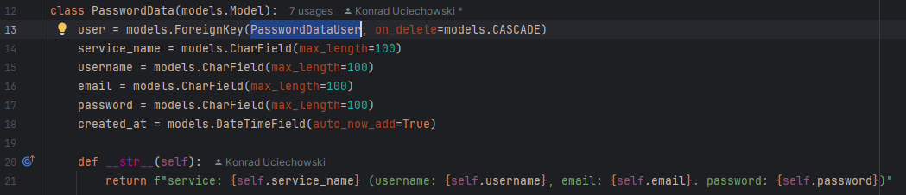
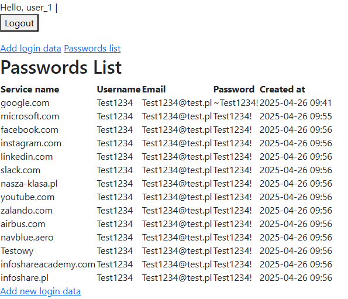
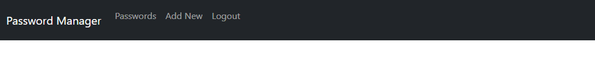
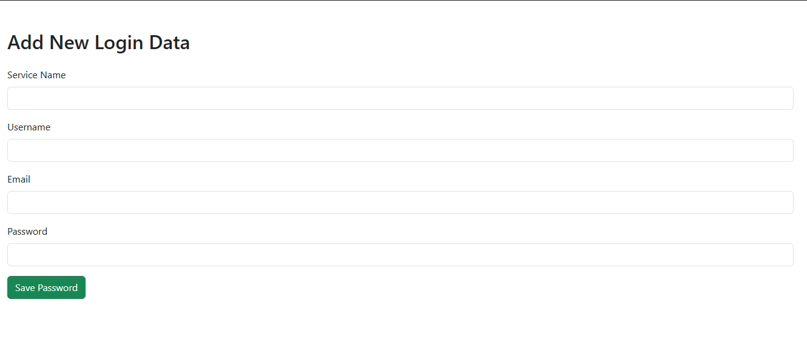
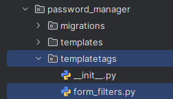
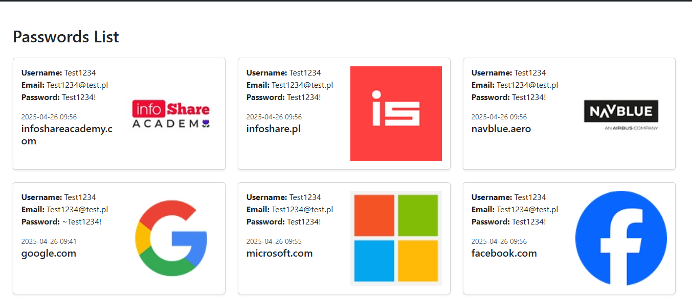
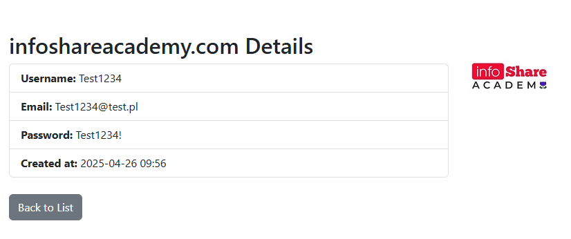

# Django Revise

------

## Step 1 Changes:

* [Create django project](#Create-Django-Project)

------

## Step 2 Changes:

* [Setup MySQL Connection in Application](#Setup-MySQL-Connection)
* [Add Django Rest Framework in Project](#Setup-Django-Rest-Framework-in-Project)
* Run command `python manage.py migrate` to migrate django default tables it should look like that <br />
  


* Run command `python manage.py runserver` to check if app is running
* After running django server You can open http://127.0.0.1:8000/ and that should be the result


------

## Step 3 Changes:

* Create **Password Manager** App in project, running command `python manage.py startapp password_manager` Project
  structure should look like this <br /> 

* [Add created app to project settings.py in `INSTALLED_APPS`](#Adding-New-App-To-Project)
* [create `urls.py` file inside `password_manager` app](#Adding-Urls-from-App-to-Project)
* [create `PasswordData` model inside models.py](#Create-Model-inside-App)
* [create basic view inside `views.py`](#Create-django-view)
* [create `templates/index.html` inside `password_manager` and use it as view](#Working-with-templates)

------

## Step 4 Changes:

* [Use predefined methods to create django user](#Create-Django-User)
* [Create login page](#Create-login-page)
* [Create logout page](#Create-logout-page)
* [Create register page](#Create-register-page)

------

## Step 5 Changes

* [Create user passwords list view](#Create-user-passwords-list-view)
* [Create password entry form](#Create-password-entry-form)

------

## Step 6 Changes

* [Extend default Django User class](#Extend-default-Django-User-class)

------

## Step 7 Changes

* [Make migrations from SQL to Django Models](#Make-migrations-from-SQL-to-Django-Models)

------

## Step 8 Changes

* [Using Mixins with Django Models and Views](#Using-Mixins-with-Django-Models-and-Views)

------

## Step 9 Changes

* [Add bootstrap css in header and script in footer](#Add-bootstrap-css-in-header-and-script-in-footer)
* [Modify index.html](#Modify-index)
* [Modify forms](#Modify-forms)
* [Add templatetags](#Add-templatetags)
* [Modify password list](#Modify-password-list)
* [Add image from logo.dev](#Add-image-from-logo-dev)
* [Add Password Details template](#Add-Password-Details-template)

------

## Troubleshooting

* Error: `django.db.utils.OperationalError: (1049, "Unknown database 'django_rest_tutorial_infoshare'")` while running
  `python manage.py migrate`
    * To fix that make sure to create `django_rest_tutorial_infoshare` database before running that command.
    * Django creates database automatically only when running sqlite as
      a [documentation](https://docs.djangoproject.com/en/3.1/intro/tutorial02/) make it
      clear 
    * You can run file that is in repository `queries\step-2.sql` on your database to make sure it is created.

* if You do not see anything after running django server at http://127.0.0.1:8000/ try to open http://localhost:8000/
* When You create new app and pass `urls.py` from app to main `django_rest_tutorial_infoshare/urls.py`, you might lose
  your welcome page, the reason is that it is not declared in your app directly. It is normal behavior. Your index (
  starting) page, would probably look something like
  this <br /> 
* If You have problem with creating new user after already setting `PasswordData` to existing one, You need to delete
  all `migrations` files folder from `password_manager/migrations` like in example below <br />
  <br />
  This action also requires to delete database that You already created, so do this only if You didn't make
  modifications by hands in your database, If You do made some changes to database, make sure to do a backup before
  deleting it.
  Then rerun commands `python manage.py makemigrations` and `python manage.py migrate`, after that everything should be
  working fine. That is related to that kind of error:

```commandline
ValueError: The field admin.LogEntry.user was declared with a lazy reference to 'password_manager.passworddatauser', but app 'password_manager' doesn't provide model 'passworddatauser'.
The field password_manager.PasswordData.user was declared with a lazy reference to 'password_manager.passworddatauser', but app 'password_manager' doesn't provide model 'passworddatauser'.
```

------

## How to run a project step by step

1. Install Django using pip `pip install Django` (or `pip3 install Django`)
2. [Install MySQL](#MySQL-Installation-Guide)
3. install Django_Rest_framework using pip `pip install djangorestframework` (or `pip3 install djangorestframework`)
4. Install python mysqlclient using pip `pip install mysqlclient` (or `pip3 install mysqlclient`)
5. [Create django project](#Create-Django-Project)
6. [Modify database dictionary to set up MySQL Connection](#Setup-MySQL-Connection)
7. [Add Django Rest Framework in Project](#Setup-Django-Rest-Framework-in-Project)
8. Run django project using command `python manage.py runserver` (or `python3 manage.py runserver`)

------

## MySQL Installation Guide

1. Install MySQL From website https://dev.mysql.com/downloads/installer/
2. If You are using windows

------

## Create Django Project

* Using django admin `django-admin startproject mysite django_rest_tutorial_infoshare`
* Using Pycharm

------

## Setup MySQL Connection

* Find `settings.py` file and modify `DATABASES` entry

```python
PROJECT_NAME = 'django_rest_tutorial_infoshare'

DATABASES = {
    'default': {
        'ENGINE': 'django.db.backends.mysql',
        'NAME': PROJECT_NAME,
        'USER': 'django_user',
        'PASSWORD': 'root',
        'HOST': 'localhost',
        'PORT': '3306',
    }
}
```

* In `'default'` key change `ENGINE` to `django.db.backends.mysql`, make sure that you have `mysqlclient` installed
  using `pip install mysqlclient`.
* Setup `NAME`, `USER`, `PASSWORD`, `HOST` and `PORT` as it is in example. Make sure that you know your user name to
  database and password, for me, it is `django_user` and `root`.

------

## Setup Django Rest Framework in Project

* Find `settings.py` file and modify `INSTALLED_APPS` entry and put there `'rest_framework'` like in example

```python
INSTALLED_APPS = [
    'django.contrib.admin',
    'django.contrib.auth',
    'django.contrib.contenttypes',
    'django.contrib.sessions',
    'django.contrib.messages',
    'django.contrib.staticfiles',
    'rest_framework'
]
```

------

## Adding New App To Project

* Open `settings.py` file in project
* Find `INSTALLED_APPS` dictionary
* Add link to config file to newly added to project
  app <br /> 

------

## Adding Urls from App to Project

* Create `urls.py` file inside `password_manager`
  app <br /> 
* in `password_manager/urls.py` set `urlpatterns` list (it can be empty for now, example presents finished path with
  views, it is going to be made later in **Step 3
  **)<br /> 
* import `password_manager/urls.py` into project
  `urls.py` <br /> 

------

## Create Model inside App

* Open `password_manager/models.py`
* There create new model class, for example PasswordData:

```python
from django.contrib.auth.models import User
from django.db import models


class PasswordData(models.Model):
    user = models.ForeignKey(User, on_delete=models.CASCADE)
    service_name = models.CharField(max_length=100)
    username = models.CharField(max_length=100)
    email = models.CharField(max_length=100)
    password = models.CharField(max_length=100)
    created_at = models.DateTimeField(auto_now_add=True)

    def __str__(self):
        return f"service: {self.service_name} (username: {self.username}, email: {self.email}. password: {self.password})"
```

* run command `python manage.py makemigrations` to create database reflection of the created models.
* to set tables into database run `python manage.py migrate` or if You would like to see all queries run
  `python manage.py sqlmigrate`.
* After that `django_rest_tutorial_infoshare` database should look like this, it should have new table called
  `password_manager_passworddata` <br /> 
* `password_manager_passworddata` should have every field that was declared inside
  `models.py` <br /> 

------

## PasswordData - explanation

PasswordData model class represents every entry in password manager.

```python
from django.contrib.auth.models import User
from django.db import models


class PasswordData(models.Model):
    user = models.ForeignKey(User, on_delete=models.CASCADE)
    service_name = models.CharField(max_length=100)
    username = models.CharField(max_length=100)
    email = models.CharField(max_length=100)
    password = models.CharField(max_length=100)
    created_at = models.DateTimeField(auto_now_add=True)

    def __str__(self):
        return f"service: {self.service_name} (username: {self.username}, email: {self.email}. password: {self.password})"
```

fields explanation:

* `user` - reflects foreign key from base django `User` class. It is used to make connection between user and password
  data, in case if more users would use that app.
* `service_name` - represents service name, it is simple string value and from database perspective it has limit for 100
  characters.
* `username` - represents username, some apps uses auth option different from email, that field reflects this kind of
  situation
* `email` - user email, used to login into given service
* `password` - password used to login into given service
* `created_at` - represents date of entry creation
* `__str__` - function that returns couple of field values

------

## Create django view

* In `password_manager/views.py` set function that represents view that will be visible for user, it can be something
  like that:

```python
from django.http import HttpResponse


def index(request):
    return HttpResponse("Password Manager")
```

* every view function needs one parameter, it is conventionally named `request`, and it has to return `HttpResponse`
  object.
* `HttpResponse` can be filled with multiple values like, data from models, templates, etc. For this example we simply
  return string.
* When we create that kind of view we set it in `password_manager/urls.py`. Where `views.index` is a name of function
  that we just created but passed into `path`. <br /> 
* It tells django to render that view when user opens http://127.0.0.1:8000/password-manager/.
* When we open that page we should see something like
  that <br /> 

------

## Working with templates

* Templates can be used to render view with some values.
* If You would like to use templates you need to create `templates` directory inside `password_manager` app.
* `TEMPLATES` variable inside `settings.py` tells django that it should look for `templates` folder in every app, You
  don't need to change anything there.
* In `templates` we can create all html files. For example
  `index.html` <br /> 
* Inside `index.html` file we setup base html structure like that

```html

<html lang="pl">
<head>
    <title>Password Manager Welcome Page</title>
</head>
<body>
<div>
    This is index page for Password Manager...
</div>
</body>
</html>
```

* Next step would be to create view for that in `password_manager/views.py`

```python
from django.http import HttpResponse
from django.template import loader


def template_index(request):
    template = loader.get_template("index.html")
    context = {}
    return HttpResponse(template.render(context, request))
```

* Right now created function called `template_index`.
* We load our index.html with template loader `from django.template import loader`
* Then return `HttpResponse` object like in previous example, but this time we use `render` function to tell django that
  we are going to present web page to user.
* `render.template` function require two parameters, first one is `context` that represents values from database that
  will be presented to user (but can be also an empty object if we are not going to present anything), second parameter
  is our index.html `template`.
* last step is to set our `template_index` inside `password_manager/urls.py`

```python
from django.urls import path

from password_manager import views

urlpatterns = [
    path('template-index/', views.template_index, name='template_index'),
]
```

* It is same example like with `views.index`, but this time we use here view that is loaded from template.
* When we visit page http://127.0.0.1:8000/password-manager/template-index/, we should see something like
  that <br /> 

------

## Create Django User

* user in django can be created using command `python manage.py createsuperuser`
* with shell script `python manage.py shell`

```python
from django.contrib.auth.models import User

user = User.objects.create_user(username='user_1', password='Test1234!')
user.save()
```

* with custom login template/model/view (that is probably most advanced option)
* using already created by Django `UserCreationForm` that is part of `django.contrib.auth.forms`

------

## Create PasswordDataUser

* with shell script `python manage.py shell`

```python
from password_manager.models import PasswordDataUser

user = PasswordDataUser.objects.create_user(username='user_1', password='Test1234!')
user.save()
```

* with custom login template/model/view (that is probably most advanced option)
* using already created by Django `UserCreationForm` that is part of `django.contrib.auth.forms`

------

## Create login page

* To login user, we need to create `login.html` in `templates` of our `password_manager` app

```html
<h1>Login form</h1>

<form method="post">
    
    {{ form.as_p }}
    <button type="submit">Login</button>
</form>
```

This form contains couple of HTML tags:

- `h1` - represents html header it makes text that is inside of tags bigger.
- `form` - that tag create form and as attribute declares http method that will be used to sent data from form, `POST`
  in this situation
- `` - is a protection from gathering info about user data (like login/password) from malicious
  software, like malicious sites that uses cookies to get info about user.
- `{{ form.as_p }}` - that is a Django type shortcut to create all labels and inputs for every field required to login
  user
- `button` - button is responsible to sent data to `UserCreationForm` and validate it.

* next is to use predefined `views` from `auth` library inside `password_manager/urls.py`. It is worth notice here that
  `template_name` parameter is directing to `templates/login.html` that we just created.

```python
from django.urls import path

from django.contrib.auth import views as auth_views

urlpatterns = [
    path('login/', auth_views.LoginView.as_view(template_name='login.html'), name='login')
]
```

* last step is to set variable called `LOGIN_REDIRECT_URL` in `settings.py`, it can be dynamic and depend on app but for
  now we are focusing on redirect user to `index` of `password_manager` app, after successful login.

```python
LOGIN_REDIRECT_URL = '/password-manager/'
```

------

## Create logout page

* Logout is similar to login but this time in `password_manager/urls.py` we are just setting predefined `LogoutView`,
  without creating any logout template

```python
from django.urls import path

from django.contrib.auth import views as auth_views

urlpatterns = [
    path('logout/', auth_views.LogoutView.as_view(), name='logout'),
]
```

* and like in login redirection, we need to set redirection point on logout in `settings.py`, variable is called
  `LOGOUT_REDIRECT_URL` and we are focusing on redirect user to login page after logout.

```python
LOGOUT_REDIRECT_URL = '/password-manager/login/'
```

------

## Create register page

* For registration new users we will be using custom view register form, but we will use inside it predefined
  `UserCreationForm`
* in `views.py`, we created `register_form` where we are putting data from form in `templates/register.html` to create
  user. Build in `login` function from `django.contrib.auth` is responsible for login user after registration. User will
  be redirected to `index.html` after creation.

```python
from django.contrib.auth.forms import UserCreationForm
from django.http import HttpResponse
from django.shortcuts import redirect
from django.template import loader
from django.contrib.auth import login


def register_form(request):
    if request.method == "POST":
        form = UserCreationForm(request.POST)
        if form.is_valid():
            user = form.save()
            login(request, user)
            return redirect("index")
    else:
        form = UserCreationForm()
    register_template = loader.get_template("register.html")
    context = {"form": form}
    return HttpResponse(register_template.render(context, request))
```

* we need already mentioned template `templates/register.html`. It is very similar to `login.html`.

```html
<h1>Register form</h1>

<form method="post">
    
    {{ form.as_p }}
    <button type="submit">Register</button>
</form>
```

* last step is to setup `register_form` inside `password_manager/urls.py`

```python
from django.urls import path

from password_manager import views as password_manager_views

urlpatterns = [
    path('register/', password_manager_views.register_form, name='register'),
]
```

------

## Create user passwords list view

* Listing passwords, just take all `PasswordData`, that belongs to logged-in user and returns it with
  `password_list.html` in view

```python
from django.contrib.auth.decorators import login_required
from password_manager.models import PasswordData
from django.template import loader
from django.http import HttpResponse


@login_required
def passwords_list(request):
    entries = PasswordData.objects.filter(user=request.user)
    passwords_list_template = loader.get_template("passwords_list.html")
    context = {'entries': entries}
    return HttpResponse(passwords_list_template.render(context, request))
```

* like in previous examples we need setup `urls.py`

```python
from django.urls import path

from password_manager import views as password_manager_views

urlpatterns = [
    path('passwords_list/', password_manager_views.passwords_list, name='passwords_list'),
]
```

* And `passwords_list.html` in `templates`

```html
<h2>Passwords list</h2>

<table>
    <tr>
        <th>Service name</th>
        <th>Username</th>
        <th>Email</th>
        <th>Password</th>
        <th>Created at</th>
    </tr>
    
    <tr>
        <td>{{ entry.service_name }}</td>
        <td>{{ entry.username }}</td>
        <td>{{ entry.email }}</td>
        <td>{{ entry.password }}</td>
        <td>{{ entry.created_at|date:"Y-m-d H:i" }}</td>
    </tr>
    
    <tr>
        <td colspan="4">No passwords</td>
    </tr>
    
</table>

<p><a href="">Add new login data</a></p>
```

------

## Create password entry form

* To create new password entry, we need to create new `view`, `add_password_form`, it works similar as register form but
  this time it setting `PasswordData` model with values from form.
* It is also adding `@login_required` decorator, which informs django that only logged in user can access that form.

```python
from django.contrib.auth.decorators import login_required
from password_manager.models import PasswordData
from django.shortcuts import redirect
from django.http import HttpResponse
from django.template import loader


@login_required
def add_password_form(request):
    if request.method == 'POST':
        service_name = request.POST.get('service_name')
        username = request.POST.get('username')
        email = request.POST.get('email')
        password = request.POST.get('password')

        entry = PasswordData(user=request.user,
                             service_name=service_name,
                             username=username,
                             email=email,
                             password=password)
        entry.save()

        return redirect('passwords_list')

    add_password_form_template = loader.get_template("add_password_form.html")
    context = {}
    return HttpResponse(add_password_form_template.render(context, request))
```

* As always view need to be registered in `urls.py`

```python
from django.urls import path

from password_manager import views as password_manager_views

urlpatterns = [
    path('add_password_form/', password_manager_views.add_password_form, name='add_password_form'),
]
```

* And we need a template in `templates/add_password_form.html`. Instead of `{{ form.as_p }}` shortcut, we use custom
  labels and input, notice that it has to have same `name` attributes like fields in `PasswordData` model.

```html
<h2>Add login data</h2>

<form method="post">
    
    <label for="service_name">Service Name:
        <input type="text" name="service_name" required><br><br>
    </label>
    <label for="username">Username:
        <input type="text" name="username" required><br><br>
    </label>
    <label for="email">Email:
        <input type="text" name="email" required><br><br>
    </label>
    <label for="password">Password:
        <input type="password" name="password" required><br><br>
    </label>
    <button type="submit">Save</button>
</form>

<p><a href="">Return to passwords list</a></p>
```

------

## Extend default Django User class

* Django creators suggests to use default User for Admin proposes only
* For every other use case documentation suggests to extend `AbstractUser` that is part of `django.contrib.auth.models`
    * Django allows to use own User model as a default one, for this it is required to add new variable called
      `AUTH_USER_MODEL` to `settings.py`

```python
  AUTH_USER_MODEL = 'password_manager.PasswordDataUser'
```

* Before creating custom User model our database looks like that <br />
  
* Next step is to create our User class in `password_manager/models.py`

```python
from django.contrib.auth.models import AbstractUser


class PasswordDataUser(AbstractUser):
    def __str__(self):
        return f"username: {self.username}, email: {self.email}"
```

* we simply extend `AbstractUser` model that is part of django library to create our `PasswordDataUser`, this user has
  most of properties from `User` class that we used before. We put only `__str__` function but only to not leave body of
  class empty.

* do not forget to change user foreign key in `PasswordData` after that change from `User` to `PasswordDataUser`
  
* Just like it was mentioned before, we need to declare new `User` class in `settings.py`, for that simply put
  `AUTH_USER_MODEL` in settings file, it can be anywhere in file

```python
AUTH_USER_MODEL = "password_manager.PasswordDataUser"
```

* Last step is to use Django cli (commands) to create migrations and migrate new User class. For that we need two
  commands:

```commandline
python manage.py makemigrations
python manage.py migrate
```

* After successfully running migrations we should see 3 new tables in our database <br />
  
* If You would like to create user (for testing) that is based on `PasswordDataUser`, you can see a
  tutorial [here](#Create-PasswordDataUser)

------

## Make migrations from SQL to Django Models

* If You have existing `django_rest_tutorial_infoshare` database, make a backup of it (if You need to), and remove it
* Run file `step-7.sql` in your database program of choice (Dbeaver, Pycharm etc.)
* To migrations in reverse way, so we already have created database in some sql engine for example, MySQL, we have to
  setup database like in [this step](#Setup-MySQL-Connection) but in database name set already existing database.
* Then run command `python manage.py inspectdb`, by default command take all tables from existing database and try to
  map it to `models.py`
* We can set a file where models should be created: `python manage.py inspectdb > password_manager/models.py`
* There is also an option to pass couple of tables that we would like to create as a models and skip every other ones:
  `python manage.py inspectdb table1 table2`
* After running `python manage.py insepctdb > password_manager/models.py` models file should be looks like that:

```python
# This is an auto-generated Django model module.
# You'll have to do the following manually to clean this up:
#   * Rearrange models' order
#   * Make sure each model has one field with primary_key=True
#   * Make sure each ForeignKey and OneToOneField has `on_delete` set to the desired behavior
#   * Remove `managed = False` lines if you wish to allow Django to create, modify, and delete the table
# Feel free to rename the models, but don't rename db_table values or field names.
from django.db import models


class PasswordData(models.Model):
    user = models.ForeignKey('User', models.DO_NOTHING, blank=True, null=True)
    service_name = models.CharField(max_length=100, blank=True, null=True)
    username = models.CharField(max_length=100, blank=True, null=True)
    email = models.CharField(max_length=100, blank=True, null=True)
    password = models.CharField(max_length=100, blank=True, null=True)
    created_at = models.DateTimeField(blank=True, null=True)

    class Meta:
        managed = False
        db_table = 'password_data'


class User(models.Model):
    username = models.CharField(max_length=100, blank=True, null=True)
    first_name = models.CharField(max_length=100, blank=True, null=True)
    last_name = models.CharField(max_length=100, blank=True, null=True)
    email = models.CharField(max_length=100, blank=True, null=True)
    password = models.CharField(max_length=100, blank=True, null=True)
    created_at = models.DateTimeField(blank=True, null=True)

    class Meta:
        managed = False
        db_table = 'user'
```

* as you might have see, it looks different then models.py that we created manually, for example in `PasswordData` at
  `user` it has `models.DO_NOTHING` instead of `models.CASCADE`. Even django on first couple lines gives some tips how
  to improve autogenerated code.
* It is not perfect solution but it might be good place to start.

-----

## Using Mixins with Django Models and Views

* Mixins are specific type of class that can be inherited with different class, for example Model class or View class.
  It shouldn't be inherited alone but as a specific extension for different class.
* We can create default `abstract` model class for setting all models with default `created_at` and `updated_at` rows in
  tables, for that we create Mixin called `TimestampMixin`

```python
from django.db import models


class TimestampMixin(models.Model):
    created_at = models.DateTimeField(auto_now_add=True)
    updated_at = models.DateTimeField(auto_now=True)

    class Meta:
        abstract = True
```

* it looks like every model class but it has inner class, that is part of django framework called `Meta`, Meta class
  allows us to create properties and behaviors for models. For example here we setup `abstract = True`, this property
  defines that `TimestampMixin` will not be created as table during migrations. It can only be inherited in other
  models.
* So we can update our `PasswordDataUser` and `PasswordData` model classes, It will looks like this:

```python
from django.contrib.auth.models import AbstractUser
from django.db import models


# Create your models here.

class TimestampMixin(models.Model):
    created_at = models.DateTimeField(auto_now_add=True)
    updated_at = models.DateTimeField(auto_now=True)

    class Meta:
        abstract = True


class PasswordDataUser(AbstractUser, TimestampMixin):
    def __str__(self):
        return f"username: {self.username}, email: {self.email}"


class PasswordData(TimestampMixin):
    user = models.ForeignKey(PasswordDataUser, on_delete=models.CASCADE)
    service_name = models.CharField(max_length=100)
    username = models.CharField(max_length=100)
    email = models.CharField(max_length=100)
    password = models.CharField(max_length=100)

    def __str__(self):
        return f"service: {self.service_name} (username: {self.username}, email: {self.email}. password: {self.password})"
```

* We are using `TimestampMixin` instead of `models.Model` to extend our models, thanks to that after migrations, our
  database tables will have new properties: <br />
  

-----

## Add bootstrap css in header and script in footer

In template `index.html` in `head` section add bootstrap css link

```html

<head>
    <link href="https://cdn.jsdelivr.net/npm/bootstrap@5.3.2/dist/css/bootstrap.min.css" rel="stylesheet">
</head>
```

and at the bottom of page before ending `</body>` tag add bootstrap tag:

```html
...
<script src="https://cdn.jsdelivr.net/npm/bootstrap@5.3.2/dist/js/bootstrap.bundle.min.js"></script>
</body>
```

## Modify index

Django provides templating engine that allowes to re-use templates that has been defined earlier

In base html template we can define blocks that will have content inside of it, for example, we can define block called
`content` in `index.html`:

```html

```

or `title` with default values

```html
Password Manager
```

In every other html we can fill that blocks, for that it has to be extended at the top of child templates, like
`login.html`, `password_list.html` etc...

```html

```

after that we can call that blocks that we defined before

```html


Passwords List


<h2>Passwords List</h2>

```

if we create `index.html` and `passwords_list.html` that will look like this:

* index.html

```html

<html lang="pl">
<head>
    <title>Password Manager</title>
    <link href="https://cdn.jsdelivr.net/npm/bootstrap@5.3.2/dist/css/bootstrap.min.css" rel="stylesheet">
</head>
<body>

Hello, {{ user.username }} |
<form method="post" action="">
    
    <button type="submit">Logout</button>
</form>
<a href="">Add login data</a>
<a href="">Passwords list</a>

<a href="">Login</a>
<a href="">Register</a>


<div>
    
</div>

<script src="https://cdn.jsdelivr.net/npm/bootstrap@5.3.2/dist/js/bootstrap.bundle.min.js"></script>
</body>
</html>
```

* passwords_list.html

```html


Passwords List


<h2>Passwords List</h2>

<table>
    <tr>
        <th>Service name</th>
        <th>Username</th>
        <th>Email</th>
        <th>Password</th>
        <th>Created at</th>
    </tr>
    
    <tr>
        <td>{{ entry.service_name }}</td>
        <td>{{ entry.username }}</td>
        <td>{{ entry.email }}</td>
        <td>{{ entry.password }}</td>
        <td>{{ entry.created_at|date:"Y-m-d H:i" }}</td>
    </tr>
    
    <tr>
        <td colspan="4">No passwords</td>
    </tr>
    
</table>

<p><a href="">Add new login data</a></p>

```

that will be result: <br>


We can define that block/extend for every template

bootstrap gives possibility to create many component only by setting classes to `div` elements, for example `navbar`
creates top menu to page, in `navbar` there a lot of classes that can be included like `container`, `container-fluid`
`navbar-nav`, `nav-item` every possibility is described
in [Bootstrap documentation](https://getbootstrap.com/docs/5.3/components/navbar/)
When we create simple navbar like that:

```html

<nav class="navbar navbar-expand-lg navbar-dark bg-dark">
    <div class="container-fluid">
        <a class="navbar-brand" href="#">Password Manager</a>
        <div class="collapse navbar-collapse">
            <ul class="navbar-nav me-auto mb-2 mb-lg-0">
                
                <li class="nav-item">
                    <a class="nav-link" href="">Passwords</a>
                </li>
                <li class="nav-item">
                    <a class="nav-link" href="">Add New</a>
                </li>
                <form method="post" action="">
                    
                    <li class="nav-item">
                        <button class="nav-link" type="submit">Logout</button>
                    </li>
                </form>
                
                <li class="nav-item">
                    <a class="nav-link" href="">Login</a>
                </li>
                <li class="nav-item">
                    <a class="nav-link" href="">Register</a>
                </li>
                
            </ul>
        </div>
    </div>
</nav>

<div class="container mt-5">
    
</div>
```

bootstrap automatically creates for us this view: <br>


## Modify forms

Modifying forms using bootstrap in django can be a little bit more tricky. For example modifying form like
`add_password_form.html`

```html


Add Password


<h2 class="mb-4">Add New Login Data</h2>

<form method="post">
    

    <div class="mb-3">
        <label for="service_name" class="form-label">Service Name</label>
        <input type="text" class="form-control" id="service_name" name="service_name" required>
    </div>

    <div class="mb-3">
        <label for="username" class="form-label">Username</label>
        <input type="text" class="form-control" id="username" name="username" required>
    </div>

    <div class="mb-3">
        <label for="email" class="form-label">Email</label>
        <input type="email" class="form-control" id="email" name="email" required>
    </div>

    <div class="mb-3">
        <label for="password" class="form-label">Password</label>
        <input type="password" class="form-control" id="password" name="password" required>
    </div>

    <button type="submit" class="btn btn-success">Save Password</button>
</form>


```

That block of code will generate simple bootstrap-like form:


classes like mb-3/mb-4 are spacings that
are [base elements of bootstrap](https://getbootstrap.com/docs/5.3/utilities/spacing/)

## Add templatetags

If we are using autogenerated form like `{{ form.as_p }}` in template, it has to be modified to use bootstrap. We need
to create `templatetags` directory in `password_manager` and inside of it create file `form_filters.py`, folder
structure will look like that: <br>


`templatetags` are special type of modifiers for template engine it can add modify html that is generated by django
template engine.
In this situation we need to add `class="form-control"` to every input that is generated by django. For that in
`form_filters.py`, we need to create new function like `add_class`

```python
from django import template

register = template.Library()


@register.filter(name='add_class')
def add_class(field, css_class):
    return field.as_widget(attrs={"class": css_class})
```

We are registering name `add_class` using `@register.filter` decorator, in `add_class` function body we define which
parameter should be modified.
`as_widget` function has parameter `attrs` that is giving possibility to add classes to form
`attrs={"class": css_class}`.
When we create that, we need to make sure that our template html has `form_filters` loaded using
`` inside template. Django will automatically know which option file should be loaded. Then we
can use it like that `{{ form.username|add_class:"form-control" }}`. `form` property has value `username` like normally
django will generate, after that we are calling registered function `add_class` and as parameter we are passing
class-name, for that we need `form-control` from Bootstrap.

```html


<form method="post">
    
    <div class="mb-3">
        <label for="id_username" class="form-label">Username</label>
        {{ form.username|add_class:"form-control" }}
    </div>

    <div class="mb-3">
        <label for="id_password1" class="form-label">Password</label>
        {{ form.password|add_class:"form-control" }}
    </div>
    <button type="submit" class="btn btn-primary">Login</button>
</form>

<p class="mt-3">Don't have an account? <a href="">Register here</a>.</p>
```

## Modify password list

Bootstrap has multiple options to displaying lists, it has `carousel`, `list group`, `tables`, and `card`.
Cards can be used to displaying password list, we need bootstrap classes: `card`, `card-body`, `card-text`,
`card-title`. Using cards
will look like that:

```html


Passwords List


<h2 class="mb-4">Passwords List</h2>

<div class="row">
    
    <div class="col-md-4">
        <div class="card mb-4 shadow-sm">
            <div class="card-body">
                <p class="card-text">
                    <strong>Username:</strong> {{ entry.username }}<br>
                    <strong>Email:</strong> {{ entry.email }}<br>
                    <strong>Password:</strong> {{ entry.password }}
                </p>
                <small class="text-muted">{{ entry.created_at|date:"Y-m-d H:i" }}</small>
                <h5 class="card-title">{{ entry.service_name }}</h5>
            </div>
        </div>
    </div>
    
    <p>No passwords found.</p>
    
</div>

<a href="" class="btn btn-primary">Add New Password</a>

```

## Add image from logo dev

We can use external services for displaying logos for example [logo.dev](https://www.logo.dev/). After registration it
will gives us a url with token `https://img.logo.dev/<logo-service-url>?token=<token>`. In place of `<logo-service-url>`
it should be url of company like google.com, infoshareacademy.com. We can use it with our password list like that

```html

<div class="card mb-4 shadow-sm card-password">
    <div class="row card-body">
        <div class="col-sm-6">
            <p class="card-text">
                <strong>Username:</strong> {{ entry.username }}<br>
                <strong>Email:</strong> {{ entry.email }}<br>
                <strong>Password:</strong> {{ entry.password }}
            </p>
            <small class="text-muted">{{ entry.created_at|date:"Y-m-d H:i" }}</small>
            <h5 class="card-title">{{ entry.service_name }}</h5>
        </div>
        "
             alt="{{ entry.service_name }}" onerror='this.remove()'>
    </div>
</div>
```

We are adding `row` class from bootstrap that allow to split everything inside `<div class="row">` into parts. Splitting
into parts is possible by adding classes `col-sm-6`, `col-sm-12` etc. We set `` after text to have logo on right
of card. As `src` we set generated logo.dev url with django template tags with `service_name`. `img` tag has attribute
`onerror=''` that gives possibility to remove this tag when logo are not found using: `this.remove()` <br>



## Add Password Details template

Last step is to create details view for every password entry. For that we are adding view in `views.py`

```python
@login_required
def password_details(request, entry_id):
    entry = get_object_or_404(PasswordData, id=entry_id, user=request.user)
    password_details_template = loader.get_template("password_details.html")
    context = {'entry': entry}
    return HttpResponse(password_details_template.render(context, request))
```

new template `password_details.html`, it looks similar to card view but has `list` from bootstrap

```html


Password Details


<div class="row">
    <div class="col-sm-6">
        <h2>{{ entry.service_name }} Details</h2>

        <ul class="list-group">
            <li class="list-group-item"><strong>Username:</strong> {{ entry.username }}</li>
            <li class="list-group-item"><strong>Email:</strong> {{ entry.email }}</li>
            <li class="list-group-item"><strong>Password:</strong> {{ entry.password }}</li>
            <li class="list-group-item"><strong>Created at:</strong> {{ entry.created_at|date:"Y-m-d H:i" }}</li>
        </ul>
    </div>
    <div class="col-sm-6">
        
    </div>
</div>
<a href="" class="btn btn-secondary mt-4">Back to List</a>

```

we are setting up new url in `password_manager/urls.py`, it has `entry_id` parameter that define ID of password in
`PasswordData` table.

```python
    path('entry/<int:entry_id>/', password_manager_views.password_details, name='password_details'),
```

Last step is to create link from `Card` into details, For that we need to modify our `passwords_list.html`, We are
adding `<a href="" class="card-password-details"> ... </a>`, updated password list will look like that:

```html


Passwords List


<h2 class="mb-4">Passwords List</h2>

<div class="row">
    
    <div class="col-md-4">
        <a href="" class="card-password-details">
            <div class="card mb-4 shadow-sm card-password">
                <div class="row card-body">
                    <div class="col-sm-6">
                        <p class="card-text">
                            <strong>Username:</strong> {{ entry.username }}<br>
                            <strong>Email:</strong> {{ entry.email }}<br>
                            <strong>Password:</strong> {{ entry.password }}
                        </p>
                        <small class="text-muted">{{ entry.created_at|date:"Y-m-d H:i" }}</small>
                        <h5 class="card-title">{{ entry.service_name }}</h5>
                    </div>
                    
                </div>
            </div>
        </a>
    </div>
    
    <p>No passwords found.</p>
    
</div>

<a href="" class="btn btn-primary">Add New Password</a>

```



### Sources:

* https://stackoverflow.com/questions/19189813/setting-django-up-to-use-mysql
* https://radixweb.com/blog/create-rest-api-using-django-rest-framework
* https://docs.djangoproject.com/en/5.1/intro/tutorial01/
* https://www.django-rest-framework.org/tutorial/quickstart/
* https://stackoverflow.com/questions/40802165/have-django-to-automatically-create-database-on-migrate
* https://www.tutorialspoint.com/form-as-p-ndash-render-django-forms-as-paragraph
* https://forum.djangoproject.com/t/showing-method-not-allowed-get-users-logout/26044
* https://docs.djangoproject.com/en/4.1/topics/auth/customizing/#using-a-custom-user-model-when-starting-a-project
* https://medium.com/@karimdhrif4444/mastering-user-management-comprehensive-guide-to-extending-djangos-user-model-51c2ccd793d4
* http://dev.to/idrisrampurawala/creating-django-models-of-an-existing-db-288m
* https://docs.djangoproject.com/en/5.2/howto/legacy-databases/
* https://getbootstrap.com/docs/5.3/components/
* https://docs.djangoproject.com/en/5.2/ref/templates/language/
* https://getbootstrap.com/docs/5.3/utilities/spacing/
* https://docs.djangoproject.com/en/5.1/howto/custom-template-tags/
* https://stackoverflow.com/questions/22476273/no-access-control-allow-origin-header-is-present-on-the-requested-resource-i